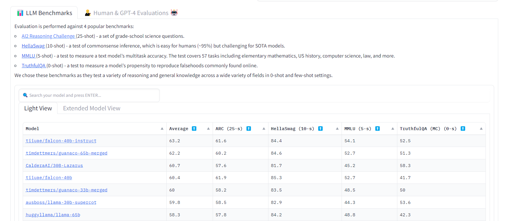

# 1 Background
LLM refers to "Large Language Model", e.g. chatgpt, llama, T5, palm. These large models require a great number of resource to execute, no matter training or inference.

How well is the model perform? How large should them be to keep functionable? We need methods to measure it.

This page contain benchmarks to measure how well LLMs are.

Public Benchmarks:
| name | runnable | language | notes |
| ---- | ---- | ---- | ---- |
| [huggingface leaderboard](https://huggingface.co/spaces/HuggingFaceH4/open_llm_leaderboard) | NO | en | opensource projects |
| [chatbot arena(lmsys.org)](https://chat.lmsys.org/?arena) | NO (simple trials available) | en | by vincuno team, using GPT-4 judgement|
| [AI2 Reasoning Challenge](https://arxiv.org/abs/1803.05457) | TODO | en | |
| [HellaSwag (10-shot)](https://arxiv.org/abs/1905.07830) | TODO | en | |
| [MMLU (5-shot)](https://arxiv.org/abs/2009.03300) | TODO | en | **widely used benchmark** |
| [TruthfulQA (0-shot)](https://arxiv.org/abs/2109.07958) | TODO | en |  |
| [C-Eval](https://arxiv.org/pdf/2305.08322v1.pdf) | TODO | zh | |
# 2 Get Started
Quickstart with [huggingface leaderboard](https://huggingface.co/spaces/HuggingFaceH4/open_llm_leaderboard), 
Evaluation is performed against 4 popular benchmarks:

- [AI2 Reasoning Challenge](https://arxiv.org/abs/1803.05457) (25-shot) - a set of grade-school science questions.
- [HellaSwag (10-shot)](https://arxiv.org/abs/1905.07830) - a test of commonsense inference, which is easy for humans (~95%) but challenging for SOTA models.
- [MMLU (5-shot)](https://arxiv.org/abs/2009.03300) - a test to measure a text model’s multitask accuracy. The test covers 57 tasks including elementary mathematics, US history, computer science, law, and more.
- [TruthfulQA (0-shot)](https://arxiv.org/abs/2109.07958) - a test to measure a model’s propensity to reproduce falsehoods commonly found online.

# 3 Top Models

| name	| tag | family root| src |
| --- | ---- | --- |  ---- |
| falcon	| 40b-instuct | falcon | https://falconllm.tii.ae/ |
| guanaco	| 65b-merged| unknown | |
| llama	| 65b| llama | |
| vicuna	| 65b| llama | https://lmsys.org/blog/2023-03-30-vicuna/ |
| chatglm | 6B | glm | https://chatglm.cn/blog |

# 4 Terms

| Term | Description |
| --- | --- |
| HellaSwag | TODO |
| ARC | TODO |
| MMLU | TODO |
| TruthfulQA | TODO |
