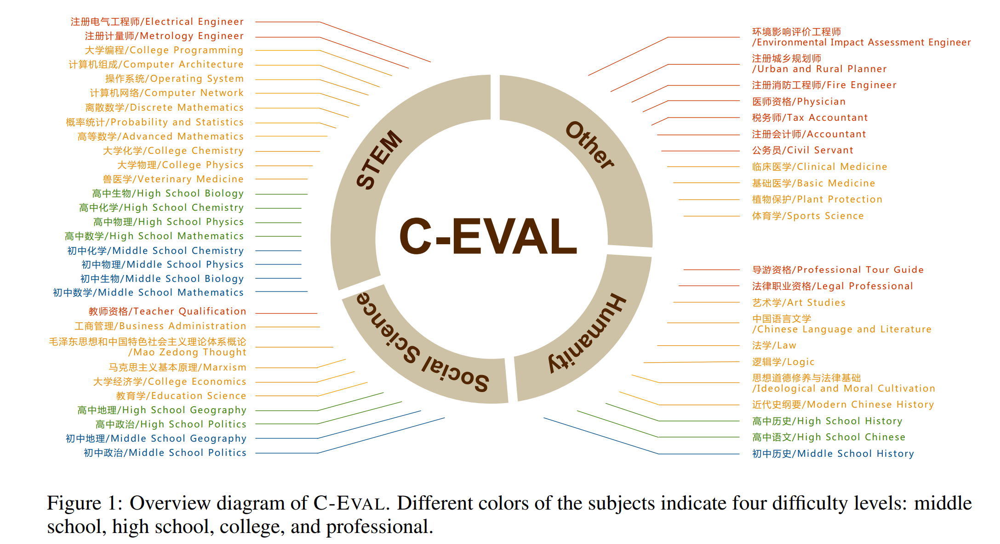

# C-Eval
## 0 References
- [Official site](https://cevalbenchmark.com/)
- [Paper](https://arxiv.org/pdf/2305.08322v1.pdf)
- [Leaderboard](https://cevalbenchmark.com/static/leaderboard.html)
- [Github](https://github.com/SJTU-LIT/ceval)

## 1 Overview
This evaluation suite is provided from Chinese research teams among Shanghai Jiao Tong University, Tsinghua University, University of Edinburgh.

Abstract as below:
```
New NLP benchmarks are urgently needed to align with the rapid development of
large language models (LLMs). We present C-EVAL , the first comprehensive 
Chinese evaluation suite designed to assess advanced knowledge and reasoning abilities
of foundation models in a Chinese context. C-EVAL comprises multiple-choice
questions across four difficulty levels: middle school, high school, college, and
professional. The questions span 52 diverse disciplines, ranging from humanities
to science and engineering. C-EVAL is accompanied by C-EVAL HARD, a subset
of very challenging subjects in C-EVAL that requires advanced reasoning abilities
to solve. We conduct a comprehensive evaluation of the most advanced LLMs on
C-EVAL, including both English- and Chinese-oriented models. Results indicate
that only GPT-4 could achieve an average accuracy of over 60%, suggesting that
there is still significant room for improvement for current LLMs. We anticipate
C-EVAL will help analyze important strengths and shortcomings of foundation
models, and foster their development and growth for Chinese users.
```



## 2 Get Start

submit eval results